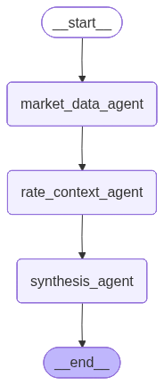

# LangGraph Code Walkthrough: Understanding the Preferred Equity Swarm

**Author:** Manus AI
**Date:** March 2026
**Project:** Preferred Equity Analysis Swarm (MSBA Capstone)

This document walks through every file in the Phase 0 codebase, explains the LangGraph concepts behind each design decision, and maps the patterns you are learning now to the full eight-agent swarm you will build by December.

---

## 1. The Big Picture: What Is LangGraph?

LangGraph is a framework for building **stateful, multi-step AI applications** as directed graphs. Think of it as a flowchart engine where each box in the flowchart is an "agent" (a Python function), and the arrows between boxes define the order of execution. The key insight is that LangGraph manages a **shared state object** that every agent can read from and write to, which is how agents communicate with each other without needing to call each other directly.

There are three core concepts you need to internalize:

| Concept | What It Is | Analogy |
|---|---|---|
| **State** | A typed dictionary that flows through the graph | A shared clipboard that every agent can read and write |
| **Node** | A Python function that receives state, does work, and returns state updates | A worker at a station on an assembly line |
| **Edge** | A connection between nodes that defines execution order | The conveyor belt between stations |

The power of LangGraph over simpler approaches (like chaining LLM calls in a loop) is that it gives you **conditional routing** (if/else logic between agents), **parallel execution** (multiple agents running at the same time), and **cycles** (agents that can loop back and re-run based on results). These are the patterns that make a true "swarm" possible.

---

## 2. File-by-File Walkthrough

### 2.1 Configuration: `src/utils/config.py`

```python
import os
from dotenv import load_dotenv

load_dotenv()

GOOGLE_API_KEY = os.getenv("GOOGLE_API_KEY", "")
GEMINI_MODEL = "gemini-2.5-flash"
SEC_USER_AGENT = os.getenv("SEC_USER_AGENT", "PreferredEquitySwarm research@example.com")
FRED_API_KEY = os.getenv("FRED_API_KEY", "")

PROJECT_ROOT = os.path.dirname(os.path.dirname(os.path.dirname(os.path.abspath(__file__))))
DATA_DIR = os.path.join(PROJECT_ROOT, "data")
```

**What this does:** This is the central configuration file. It loads API keys from a `.env` file (which is gitignored so your secrets never get committed) and defines file paths. Every other module imports from here rather than hardcoding values.

**Why it matters for LangGraph:** In a multi-agent system, you want a single source of truth for configuration. If you later switch from Gemini to GPT-4, you change one line here and every agent picks it up automatically. This is especially important when you have eight agents that all need LLM access.

---

### 2.2 Data Layer: `src/data/market_data.py`

```python
def get_preferred_info(ticker: str) -> dict:
    stock = yf.Ticker(ticker)
    info = stock.info
    result = {
        "ticker": ticker,
        "name": info.get("longName", info.get("shortName", "Unknown")),
        "price": info.get("regularMarketPrice", info.get("previousClose", None)),
        "dividend_rate": info.get("dividendRate", None),
        "dividend_yield": info.get("dividendYield", None),
        # ... more fields
    }
    return result
```

**What this does:** This is a pure data-fetching module. It wraps the `yfinance` library to pull real-time preferred stock data from Yahoo Finance. Notice that it returns a plain Python dictionary, not a LangGraph-specific object. This is intentional.

**Design principle: Keep agents thin, keep data modules reusable.** The `market_data.py` module knows nothing about LangGraph. It is a standalone utility that could be used in a Jupyter notebook, a Flask API, or a command-line script. The LangGraph agent (which we will see next) calls this module and then packages the result into the graph state. This separation means you can test your data pipelines independently of your agent logic.

---

### 2.3 Data Layer: `src/data/rate_data.py`

```python
def get_treasury_yields_from_yfinance() -> dict:
    etf_proxies = {
        "1M": "BIL",    # 1-3 month T-bills
        "2Y": "SHY",    # 1-3 year Treasury
        "5Y": "IEI",    # 3-7 year Treasury
        "10Y": "IEF",   # 7-10 year Treasury
        "20Y": "TLT",   # 20+ year Treasury
    }
    yields = {}
    for maturity, etf_ticker in etf_proxies.items():
        etf = yf.Ticker(etf_ticker)
        info = etf.info
        div_yield = info.get("yield", info.get("dividendYield", None))
        if div_yield:
            yields[maturity] = round(div_yield * 100, 2)
    return yields
```

**What this does:** This fetches Treasury yield curve data so the swarm can compare a preferred stock's yield against risk-free government rates. It has a two-tier fallback strategy: if you have a FRED API key, it pulls precise daily yields from the Federal Reserve's database. If not, it approximates yields using Treasury ETF dividend yields from Yahoo Finance.

**Why this matters for the swarm:** The Rate Context Agent does not need to know where the data comes from. It just calls `get_treasury_yields_from_yfinance()` or `get_treasury_yields_from_fred()`. This means you can upgrade the data source later (for example, adding Bloomberg data) without touching the agent code.

---

### 2.4 The Core: `src/agents/hello_world_swarm.py`

This is the heart of the project. Let us walk through it section by section.

#### Section A: The State Schema

```python
class SwarmState(TypedDict):
    """State that is passed between agents in the swarm."""
    ticker: str
    market_data: dict
    rate_data: dict
    synthesis: str
    errors: list
```

**This is the most important design decision in the entire project.** The `SwarmState` defines the shared data structure that every agent reads from and writes to. When you add new agents in Phase 2, you will extend this class with new fields (for example, `credit_rating: str`, `call_probability: float`, `tax_treatment: dict`).

Think of it as a contract: every agent promises to read certain fields and write certain fields. The Synthesis Agent, for instance, reads `market_data` and `rate_data` but writes `synthesis`. This makes the data flow explicit and debuggable.

**Key LangGraph concept:** When an agent returns a dictionary like `{"market_data": info}`, LangGraph **merges** that dictionary into the existing state. It does not replace the entire state. So the Market Data Agent can return just `{"market_data": info}` and the `ticker`, `rate_data`, `synthesis`, and `errors` fields remain untouched. This merge behavior is what allows agents to work independently without stepping on each other's data.

#### Section B: Agent Node Functions

```python
def market_data_agent(state: SwarmState) -> dict:
    ticker = state["ticker"]                          # READ from state
    info = get_preferred_info(ticker)                  # DO work
    return {"market_data": info}                       # WRITE to state
```

**The pattern is always the same: Read, Do, Write.** Every agent function follows this three-step pattern:

1. **Read** the fields it needs from the state dictionary
2. **Do** its specialized work (fetch data, call an API, run an LLM)
3. **Write** its results back by returning a dictionary with the fields it owns

The Market Data Agent and Rate Context Agent are **tool agents**: they execute deterministic operations (API calls) without using an LLM. The Synthesis Agent is a **reasoning agent**: it uses Gemini to interpret and synthesize the data collected by the tool agents.

```python
def synthesis_agent(state: SwarmState) -> dict:
    llm = ChatOpenAI(model="gemini-2.5-flash", temperature=0.3)

    market_data = state["market_data"]                 # READ
    rate_data = state["rate_data"]                     # READ

    response = llm.invoke([                            # DO (LLM call)
        SystemMessage(content=system_prompt),
        HumanMessage(content=user_prompt),
    ])

    return {"synthesis": response.content}             # WRITE
```

**Why `temperature=0.3`?** For financial analysis, you want the LLM to be relatively deterministic. A temperature of 0.3 gives it enough creativity to write natural prose but not so much that it hallucinates numbers or makes speculative claims. In Phase 2, you might use different temperatures for different agents: 0.1 for the Credit Analysis Agent (very precise) and 0.5 for the Synthesis Agent (more narrative).

#### Section C: Building the Graph

```python
def build_hello_world_graph() -> StateGraph:
    workflow = StateGraph(SwarmState)

    # Add agent nodes
    workflow.add_node("market_data_agent", market_data_agent)
    workflow.add_node("rate_context_agent", rate_context_agent)
    workflow.add_node("synthesis_agent", synthesis_agent)

    # Define execution order
    workflow.set_entry_point("market_data_agent")
    workflow.add_edge("market_data_agent", "rate_context_agent")
    workflow.add_edge("rate_context_agent", "synthesis_agent")
    workflow.add_edge("synthesis_agent", END)

    return workflow.compile()
```

**This is where LangGraph shines.** You are building a directed graph programmatically:

1. `StateGraph(SwarmState)` creates a new graph that uses your state schema
2. `add_node(name, function)` registers each agent as a node in the graph
3. `set_entry_point(name)` designates which node runs first
4. `add_edge(from, to)` draws an arrow from one node to the next
5. `compile()` validates the graph and returns an executable object

The current graph is a simple linear chain: `START -> market_data -> rate_context -> synthesis -> END`. In the next step, we will upgrade this to use **parallel branches** and **conditional edges**.

#### Section D: Running the Graph

```python
def analyze_preferred(ticker: str) -> dict:
    graph = build_hello_world_graph()

    initial_state = {
        "ticker": ticker,
        "market_data": {},
        "rate_data": {},
        "synthesis": "",
        "errors": [],
    }

    result = graph.invoke(initial_state)
    return result
```

**`graph.invoke(initial_state)` is the single line that runs the entire swarm.** You pass in the initial state (with the ticker filled in and everything else empty), and LangGraph executes each node in order, merging each agent's output into the state as it goes. When it reaches `END`, it returns the final state with all fields populated.

This is the beauty of the graph abstraction: you do not write any orchestration logic yourself. No `if` statements, no `for` loops, no error handling for agent ordering. LangGraph handles all of that based on the edges you defined.

---

## 3. The Streamlit App: `streamlit_app/app.py`

The Streamlit app is the presentation layer. It does three things:

1. **Collects input** (the ticker) from the user via a text box and quick-pick buttons
2. **Runs the swarm** by calling `analyze_preferred(ticker)`, which is the same function you can call from the command line
3. **Displays results** using Plotly charts and Streamlit metrics

The key design choice here is that the Streamlit app has **zero knowledge of LangGraph internals**. It imports one function (`analyze_preferred`), passes a ticker, and gets back a dictionary. This means you can completely rewrite the agent architecture without touching the UI, and vice versa.

---

## 4. Visual Graph Diagram

The diagram below shows the current execution flow. LangGraph can auto-generate this from your graph definition, which is extremely useful for presentations and documentation.



In the next step, we will build a more complex graph that looks like this:

```
                    +-- market_data_agent --+
                    |                       |
START --[fan-out]---+-- rate_context_agent --+--[fan-in]--> quality_check
                    |                       |                    |
                    +-- dividend_agent -----+              [conditional]
                                                           /         \
                                                     [pass]         [fail]
                                                       |               |
                                                synthesis_agent    error_handler
                                                       |               |
                                                      END             END
```

---

## 5. Mapping Phase 0 to the Full Swarm

Every pattern in the hello world code maps directly to a pattern in the full eight-agent swarm:

| Phase 0 Pattern | Full Swarm Pattern |
|---|---|
| `SwarmState` with 5 fields | `SwarmState` with 20+ fields covering all analysis dimensions |
| 2 tool agents (market data, rates) | 5 tool agents (prospectus parser, credit, rates, tax, regulatory) |
| 1 reasoning agent (synthesis) | 3 reasoning agents (call probability, relative value, synthesis) |
| Linear edges (A -> B -> C) | Parallel fan-out/fan-in with conditional routing |
| No error handling | Error fields per agent with retry logic |
| Single ticker input | Batch analysis across the full preferred universe |

The architecture scales because the fundamental pattern never changes: define state, define agents that read/do/write, define edges that control flow, compile, invoke.

---

## 6. Key Takeaways

**State is the backbone.** Design your `SwarmState` carefully because it defines what agents can communicate. Every inter-agent dependency is expressed through shared state fields.

**Agents are just functions.** There is no special agent class or decorator. Any Python function that takes state and returns a partial state update is a valid LangGraph node. This makes testing trivial: you can call any agent function directly with a mock state dictionary.

**Edges are the orchestration.** The graph structure (not the agent code) determines execution order, parallelism, and conditional branching. This separation of concerns is what makes the system maintainable as it grows from 3 agents to 8.

**The graph compiles to a runnable.** Once you call `compile()`, you get an object with an `invoke()` method that handles all the execution mechanics. You never write orchestration loops yourself.

---

## References

- [LangGraph Documentation](https://langchain-ai.github.io/langgraph/) [1]
- [LangGraph Conceptual Guide: State Management](https://langchain-ai.github.io/langgraph/concepts/low_level/) [2]
- [LangChain Google Generative AI Integration](https://python.langchain.com/docs/integrations/chat/google_generative_ai/) [3]
- [yfinance Documentation](https://github.com/ranaroussi/yfinance) [4]
- [Streamlit Documentation](https://docs.streamlit.io/) [5]

[1]: https://langchain-ai.github.io/langgraph/
[2]: https://langchain-ai.github.io/langgraph/concepts/low_level/
[3]: https://python.langchain.com/docs/integrations/chat/google_generative_ai/
[4]: https://github.com/ranaroussi/yfinance
[5]: https://docs.streamlit.io/
